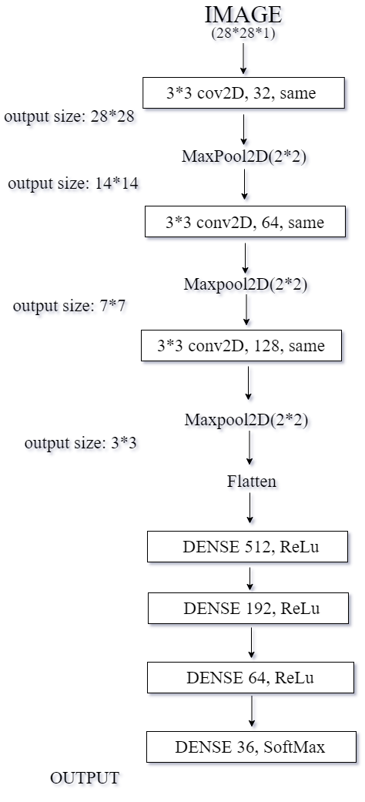
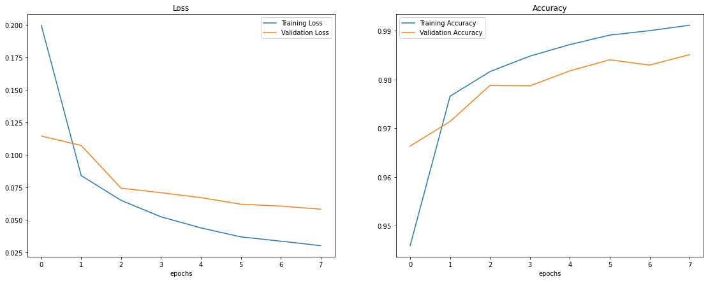

# OCR-Envision
Training computers to read and understand handwritten English characters and digits.

__Mentors__ 
Nishant Nayak 
Harshwardan Singh Rathore 

__Mentees__ 
Sana Azmiya 
Madhav Kumar 
Darshan S 
Akhilesh P 

__NOTE:__ The file __OCR_Envision.ipynb__ conatins all the code along with documentation and outputs/images. 

__Datasets Used__ 
1. MNIST Dataset 
2. A-Z Handwritten Dataset 
We compile these 2 datasets into a single dataset and later uploaded to Kaggle, which might prove useful to others with similar projects. 

__Models Used__ 
The model used contains 3 Convolutional layers followed by 4 Dense layers. In the first layer, there are 32 filters of size 3x3 with ReLU activation function with same padding followed by MaxPool layer of 2x2. In the second layer, the number of filters is increased to 64 with everything else is same as layer 1. In the third layer, the number of filters is further increased to 128. These are followed by 4 dense layers, the first three of which have ReLU activation function and the last one having softmax function which actually gives the probability of the image being in different classes of numbers and alphabets. 

Upon training the model for 8 epochs with a batch size of 128, using the Adam optimizer to optimize the learning rate, we were able to obtain 99.18% accuracy on the training data and a validation accuracy of 98.51% accuracy. The values of the loss function and accuracy vs number of epochs are plotted below: 

